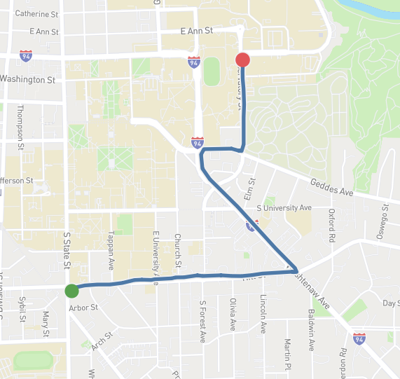
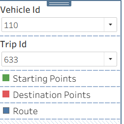
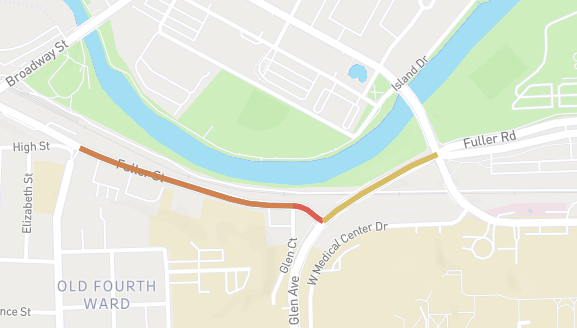
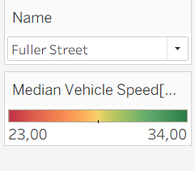
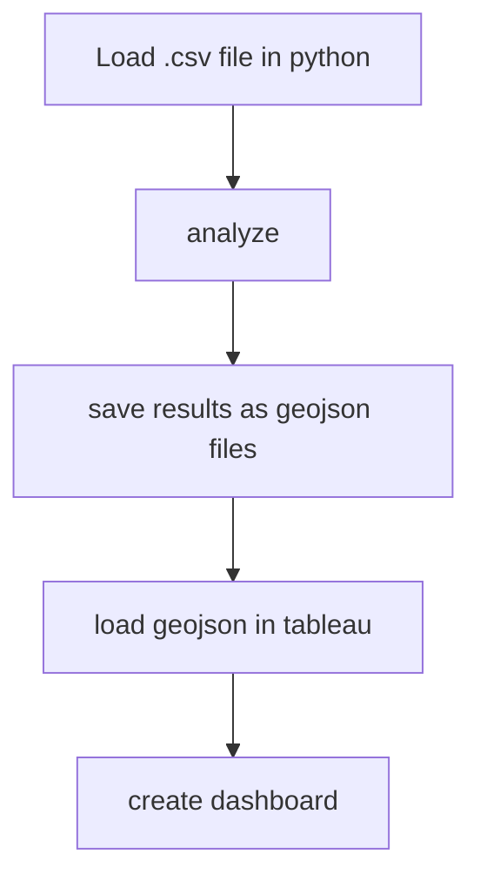

# Vehicle Fleet Dashboard 

This project contains two interactive dashboards:

- **Trip Visualization Dashboard** – shows the reconstructed route, start and end points.
- **Median Road Speed Dashboard** – displays median speed values for each road segment.

You can view both dashboards on Tableau Public:

**Dashboard Link:  https://public.tableau.com/app/profile/timur.kaygusuz/viz/VehicleFleetDashboard/TripVisualizerDashboard#1**

## 1. Trip Visualization Dashboard

This dashboard allows you to select a vehicle ID and a trip ID.
It displays:

- the start point

- the reconstructed route (LineString geometry)

- the destination point

  
  

## 2. Road Speed Analysis Dashboard

This dashboard shows the median speed in km/h for each road segment.
Each segment is color‑coded based on its median speed value.

You can select a specific road segment using the filter in the top‑right corner to inspect it in detail.

  
  

## 3. Data Source 

An exempt from the Vehicle Energy Dataset (VED) provided by G.S.Oh, David J. Leblanc and Huei Peng was used as a data source.
 
The dataset contains among other things the location and speed of personal cars collected between Nov, 2017 to Nov, 2018 in Ann Arbor, Michigan, USA 

## 4. Workflow

